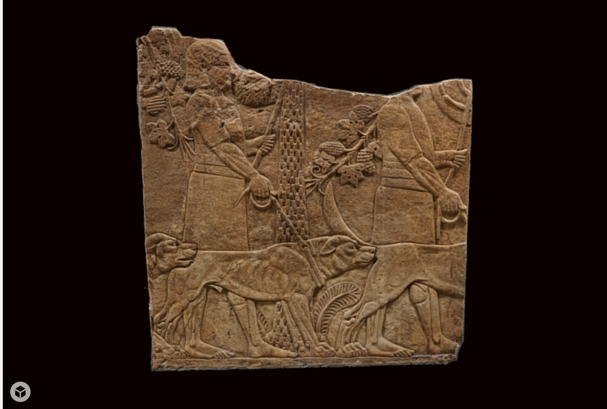

[](http://creativecommons.org/licenses/by-sa/4.0/) 
[](http://orcid.org/0000-0002-0246-2335)

# Panel 13, Ashurbanipal's palace at Nineveh



This repository contains source data to recreate a 3D model from the British Museum's Assyrian galleries. The file structure is as follows:

```
panel13/
├── README.md
├── LICENSE.md
├── Images
├── Masks
├── Other
└── Models
```
Models are included as PLY, OBJ and STL representations. 

# Metadata 

* Object type: wall panel/relief
* Museum number: 118915
* Description: Gypsum wall panel relief: depicting huntsmen with hounds under palm trees.
* AuthorityRuler: Ashurbanipal biography
* Culture/period: Neo-Assyrian term 
* Date645BC-635BC
* Excavated/Findspot: North Palace, Room E Panel 13(Asia,Iraq,North Iraq,Kouyunjik (Nineveh),North Palace)
* Materials: gypsum
* Dimensions
Height: 106.68 centimetres (approx)Width: 101.6 centimetres (approx)Depth: 17.78 centimetres (approx)
* On display: G10a/sB
* Excavated by: John George Taylor
* Excavated by: Sir Henry Creswicke Rawlinson 
* Excavated by: Hormuzd Rassam biography
* Excavated by: William Kennett Loftus biography
* Acquisition date: 1856
* Department: Middle East
* BM/Big number: 118915
* Registration number: 1856,0909.24

# LICENSE
The contents of this repository are licensed under CC-BY

# Credits
Photographs and models by Daniel Pett 
